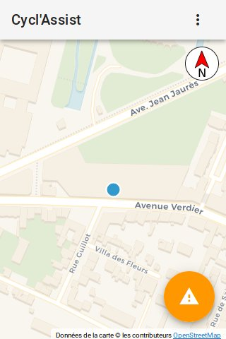
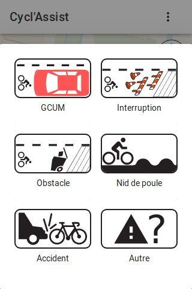

Cyclassist
==========

> Track and share issues (work, interruption in routes, parked cars) in
> realtime on bike lanes!

This app is made of two parts: a client webapp and a server part to store and
serve the issues. This code is the code running behind https://cyclo.phyks.me/
(the stable and official instance).

**A sandbox instance if you want to try it out without polluting the main instance
is available at https://cyclo-dev.phyks.me**. Please note however this is a
development instance which might be ahead of the official https://cyclo.phyks.me
instance from time to time. It might break from time to time.

As of current version, only the client side part (code running on your local
device) handles your geolocation. **Your precise geolocation is never sent**
to the server or any external resource. However, the map background is
downloaded on demand from [Thunderforest](http://thunderforest.com/) so they
could know the location of the displayed map.

 

## OpenData

The data collected by https://cyclo.phyks.me/ is available under an
[ODbL](https://opendatacommons.org/licenses/odbl/) license. You can get the
most up to date JSON dump of available reports at
https://cyclo.phyks.me/api/v1/reports.

Statistics about the instance can be fetched at
https://cyclo.phyks.me/api/v1/stats.

## Documentation

Detailed documentation about this software is available under the
[`doc/`](doc/) folder. This covers setting up your own instance, API, privacy
choices etc.

## Contributing

Check out the [CONTRIBUTING.md](CONTRIBUTING.md) file for all the required doc
and details before contributing :) Any contributions are more than welcome!

## License

This software is licensed under an MIT license, unless explicitly mentionned
otherwise.

Icons are made from the original works:
* [Bike icon](https://commons.wikimedia.org/wiki/File:Ic_directions_bike_48px.svg)
    licensed under CC BY on Wikimedia.
* [Car icon](https://commons.wikimedia.org/wiki/File:Car_icon_top.svg)
    licensed under CC BY-SA on Wikimedia.
* [Pothole icon](https://commons.wikimedia.org/wiki/File:France_road_sign_A2a.svg)
    licensed under CC BY-SA on Wikimedia.
* [Compass icon](https://commons.wikimedia.org/wiki/File:Black_and_white_compass.svg)
    licensed in public domain on Wikimedia.
* [Work icons](https://www.vecteezy.com/vector-art/87351-road-traffic-cartoon-icons-vector)
    were designed by Vecteezy.
* [Trash icon](https://pixabay.com/en/trash-waste-trashcan-garbage-99257/) is
    coming from Pixabay under CC0 license.
* [Accident icon](https://www.flaticon.com/free-icon/car-running-over-a-bicycle_91680) is
    coming from Flaticon.

Beep sound is provided under CC0 license and coming from
[freesound.org](https://freesound.org/people/thisusernameis/sounds/426888/).

The map background is using tiles from <a
href=\"https://carto.com/location-data-services/basemaps/\">Carto.com</a> or
<a href=\"http://thunderforest.com/\">Thunderforest</a>, thanks to <a
href=\"https://www.openstreetmap.org/copyright\">OpenStreetMap
contributors</a> and <a href=\"http://leafletjs.com/\">Leaflet</a>.

Manual location picking uses the awesome API from <a
href=\"https://adresse.data.gouv.fr\">adresse.data.gouv.fr</a>.

## Thanks

Thanks a lot to all users, contributors and translators for the help on this
software.

Among others, thanks to

* [Quenti](https://framapiaf.org/@Quenti) for the Occitan translation.
